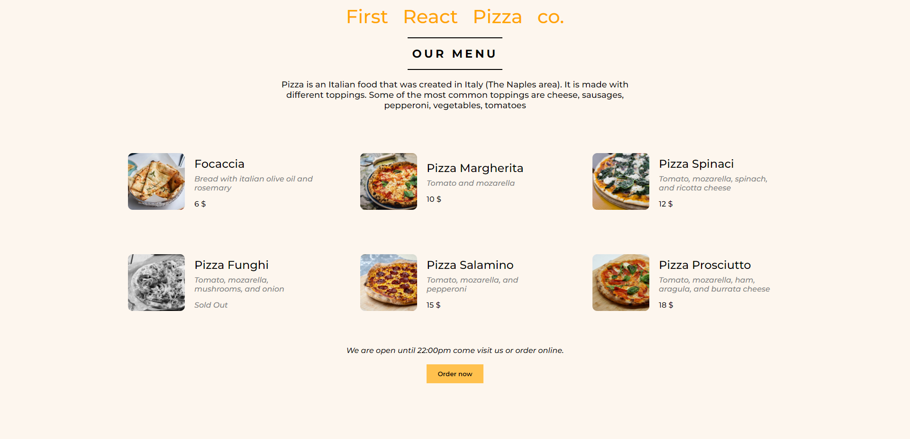

# Pizza List - React




This is a React project that displays a list of pizzas with their details. It showcases key features of React, such as components, props, and state management, allowing users to view pizzas and their descriptions.

## Features

- **Pizza Listing**: Display a list of pizzas with their details (e.g., name, ingredients, price).
- **Responsive Design**: Adjusts layout for different screen sizes.
- **React Components**: Uses reusable components for scalability.
  
## Installation

1. Clone this repository:
   ```bash
   git clone https://github.com/SaidosHits/Pizza-list-React.git
2. Navigate to the project folder:
   ```bash
   cd Pizza-list-React
3. Install the required dependencies:
   ```bash
   npm install
4. Running the Application
   ```bash
   npm start

Open http://localhost:3000 in your browser to view the app.
